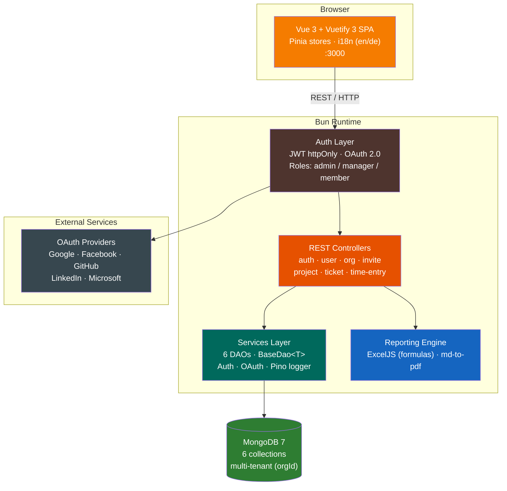

# TickyTack

Full-stack time tracking and project management application with weekly calendar view, multi-tenant organization support, and Excel/PDF export with formula-based calculations.

## Features

| Category | Feature | Status |
|----------|---------|--------|
| **Time Tracking** | Weekly calendar with drag-and-drop | :white_check_mark: |
| | 15-minute snap grid, resize handles | :white_check_mark: |
| | Daily, weekly, monthly views | :white_check_mark: |
| **Project Management** | Full CRUD with auto-generated ticket keys | :white_check_mark: |
| | Color-coded projects | :white_check_mark: |
| | Ticket status workflow (open → done → closed) | :white_check_mark: |
| **Export** | Excel with formulas (`=SUM()`, `=(End-Start)*24`) | :white_check_mark: |
| | PDF via markdown rendering | :white_check_mark: |
| | Preview table with editable descriptions | :white_check_mark: |
| **Auth** | JWT httpOnly cookies | :white_check_mark: |
| | OAuth (Google, Facebook, GitHub, LinkedIn, Microsoft) | :white_check_mark: |
| | Invite system (shareable links, email invites) | :white_check_mark: |
| **Multi-Tenancy** | Organization-based data isolation | :white_check_mark: |
| | Role-based access (admin, manager, member) | :white_check_mark: |
| **i18n** | English & German with one-click toggle | :white_check_mark: |
| **Theme** | Dark/Light mode with persistence | :white_check_mark: |

## Tech Stack

| Layer | Technology |
|-------|-----------|
| **Runtime** | [Bun](https://bun.sh/) |
| **Backend** | [Elysia.js](https://elysiajs.com/), Mongoose |
| **Database** | MongoDB 7 |
| **Frontend** | Vue 3 (Composition API), Vuetify 3, Pinia, Vue Router 4, vue-i18n 9 |
| **Reporting** | ExcelJS (formulas), md-to-pdf |
| **Build** | Bun workspace monorepo, Vite 7 |
| **Testing** | Bun test + mongodb-memory-server, Playwright 1.52 |
| **Infrastructure** | Docker Compose |

## Architecture



## Quick Start

```bash
# Install dependencies
bun install

# Start MongoDB
docker compose up -d mongodb

# Seed database
bun run packages/tests/seed/seed.ts

# Start API (port 3001) and UI (port 3000)
bun run dev:api
bun run dev:ui
```

Login: Organization `oebb` / Username `gjovanov` / Password `admin123`

## Scripts

| Command | Description |
|---------|-------------|
| `bun run dev:api` | Start API with watch mode (port 3001) |
| `bun run dev:ui` | Start Vite dev server (port 3000) |
| `bun run build:ui` | Production UI build |
| `bun run test` | Run integration tests |
| `bun run test:e2e` | Run Playwright E2E tests |

## Documentation

| Document | Description |
|----------|-------------|
| [Architecture](docs/architecture.md) | System overview, package graph, request flow |
| [Data Model](docs/data-model.md) | ER diagram, entity fields and relationships |
| [API Reference](docs/api.md) | All REST endpoints with methods and parameters |
| [UI & Components](docs/ui.md) | Pages, views, components, state management |
| [Export](docs/export.md) | Excel formulas, column layout, description overrides |
| [Testing](docs/testing.md) | Test suites, coverage, how to run |

## License

ISC
