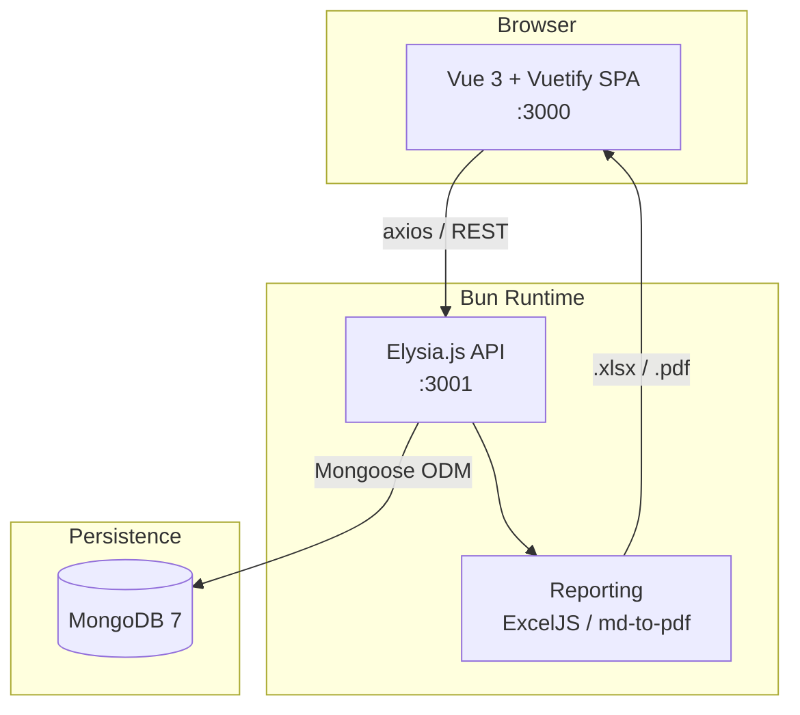
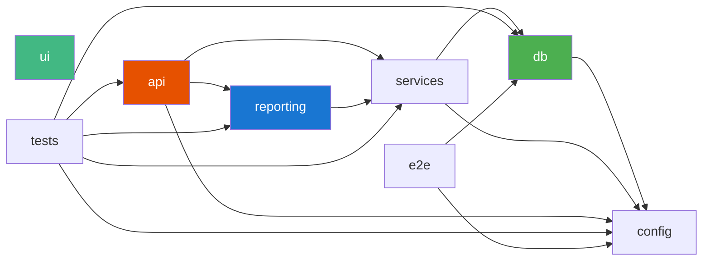
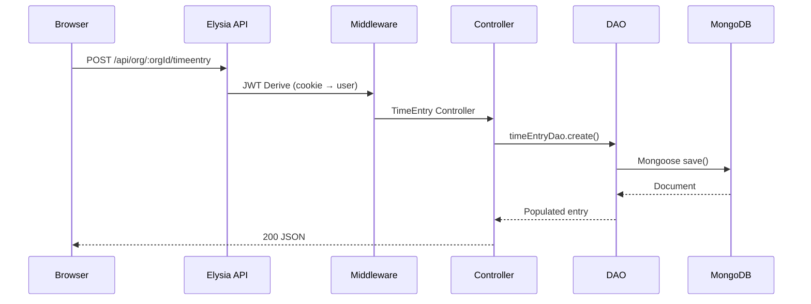
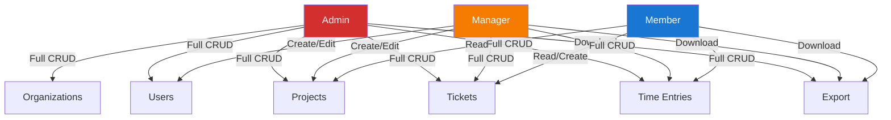
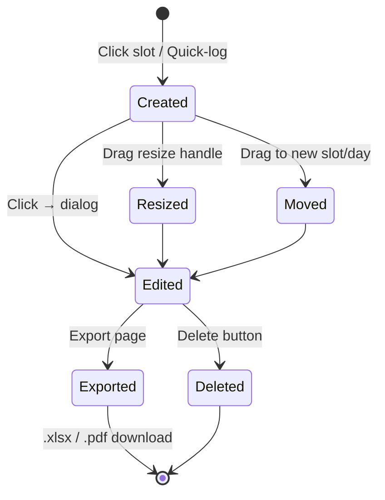
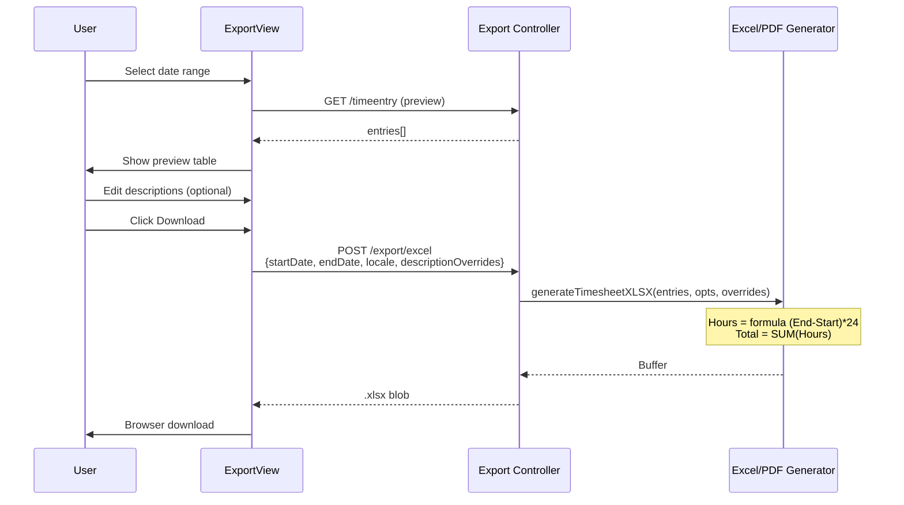
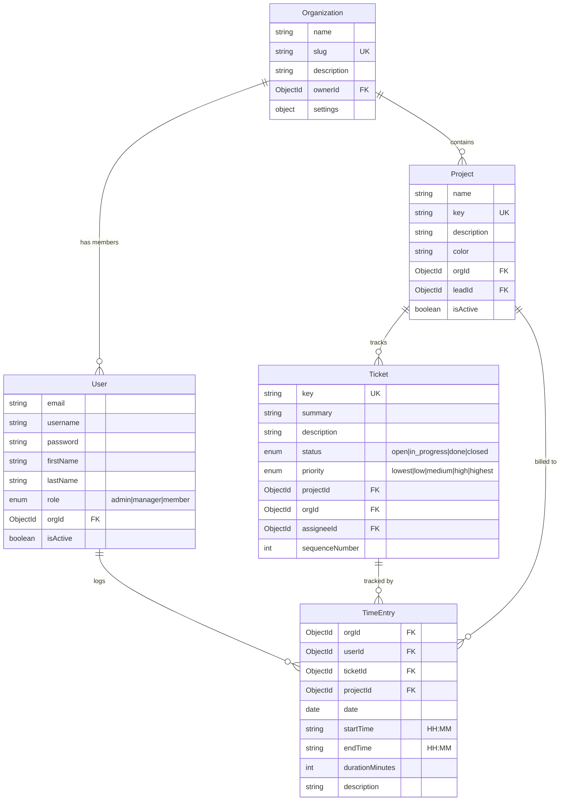
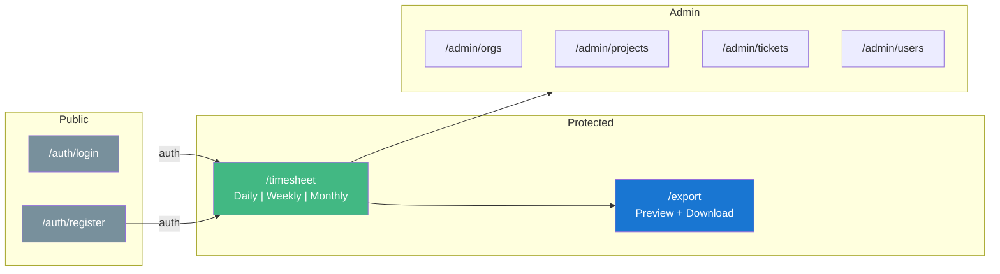
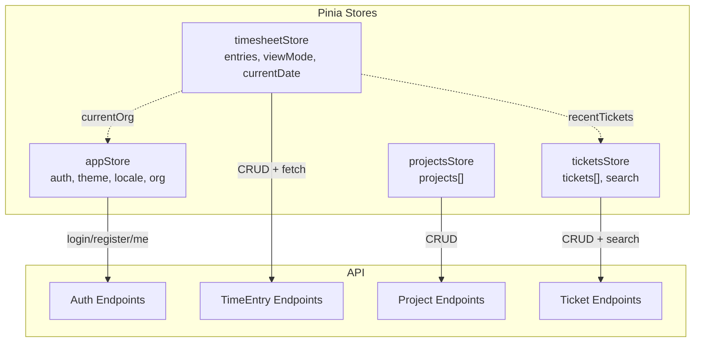
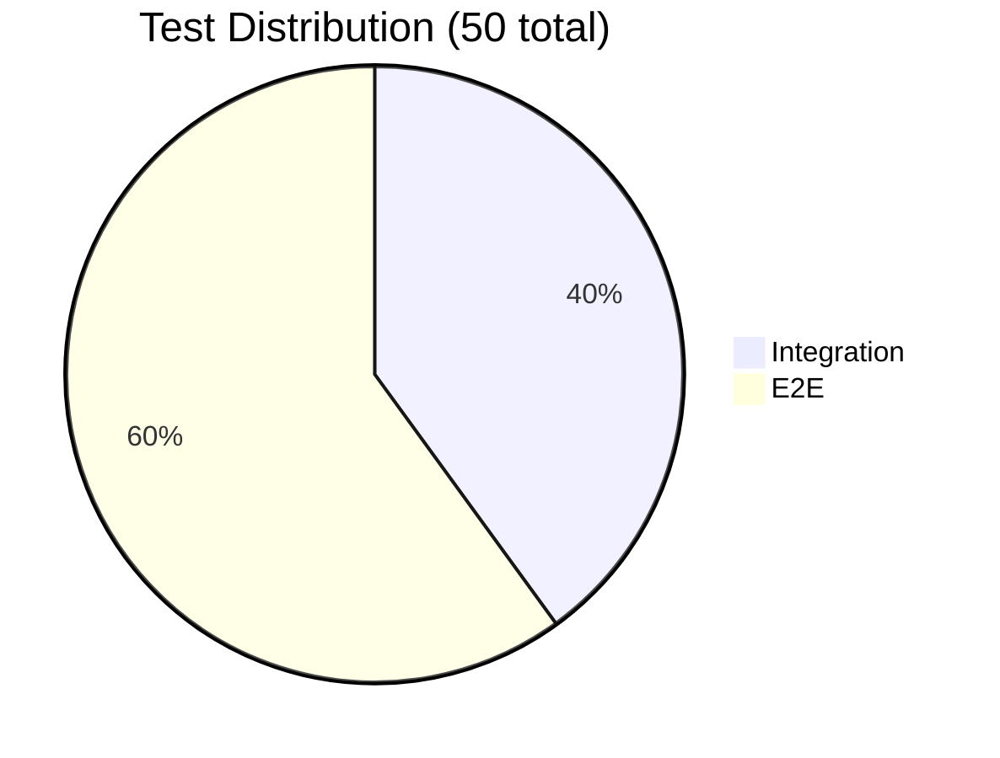

# TickyTack

A full-stack time tracking application replicating JIRA ClockWork functionality, with a weekly calendar view, multi-tenant organization support, and Excel/PDF export with formula-based calculations.

## Features

- **Weekly Calendar Timesheet** — Drag-and-drop time entries with 15-minute snap grid, resize handles, and three view modes (daily, weekly, monthly)
- **Multi-Tenancy** — Organization-based data isolation with slug-based login
- **Project & Ticket Management** — Full CRUD with auto-generated ticket keys and color-coded projects
- **User Management** — Role-based access control (admin, manager, member)
- **Export with Preview** — Preview table with editable descriptions, Excel formulas (`=(End-Start)*24`, `=SUM()`), and PDF markdown rendering
- **Internationalization** — Full EN/DE locale support with one-click toggle
- **Dark/Light Theme** — Persistent theme toggle
- **JWT Authentication** — Secure httpOnly cookie-based auth

## Architecture

### System Overview



### Monorepo Package Graph



### Request Flow



## Tech Stack

| Layer | Technology |
|-------|-----------|
| **Backend** | [Elysia.js](https://elysiajs.com/) (Bun runtime), MongoDB 7, Mongoose |
| **Frontend** | Vue 3 (Composition API), Vuetify 3, Pinia, Vue Router 4, Vue i18n 9 |
| **Reporting** | ExcelJS (formulas), md-to-pdf |
| **Build** | [Bun](https://bun.sh/) workspace monorepo, Vite 7 |
| **Testing** | Bun test + mongodb-memory-server (integration), Playwright 1.52 (E2E) |
| **Infrastructure** | Docker Compose (MongoDB 7 + app) |

## Quick Start

### Prerequisites

- [Bun](https://bun.sh/) >= 1.0
- [MongoDB](https://www.mongodb.com/) running locally (port 27017) or via Docker

### Setup

```bash
# Install dependencies
bun install

# Start MongoDB (option A: Docker)
docker compose up -d mongodb

# Start MongoDB (option B: local installation)
mongod --dbname tickytack

# Seed the database with sample data
bun run packages/tests/seed/seed.ts

# Start API server (port 3001)
bun run dev:api

# Start UI dev server (port 3000) - in another terminal
bun run dev:ui
```

Open http://localhost:3000 and log in with:
- **Organization:** `oebb`
- **Username:** `gjovanov`
- **Password:** `admin123`

## Project Structure

```
tickytack/
├── packages/
│   ├── config/        # Environment configuration loader
│   ├── db/            # Mongoose models and MongoDB connection
│   ├── services/      # Data Access Objects (DAOs) and logger (Pino)
│   ├── api/           # Elysia.js REST API server
│   ├── reporting/     # Excel (formulas) and PDF (markdown) export
│   ├── ui/            # Vue 3 + Vuetify frontend SPA
│   ├── tests/         # Integration tests and seed script
│   └── e2e/           # Playwright E2E tests (30 tests)
├── docker-compose.yaml
├── Dockerfile
├── .env               # Dev environment variables
└── .env.test          # Test environment variables
```

## Use Cases

### User Roles & Permissions



### Time Entry Lifecycle



### Export Workflow



## Data Model



## UI Pages



### Views & Components

| View | Components | Description |
|------|-----------|-------------|
| **TimesheetView** | CalendarToolbar, WeeklyCalendar, DailyCalendar, MonthlyCalendar, DailyColumn, TimeEntryCard, TimeEntryDialog, TimesheetSummary, RecentTickets | Main time tracking interface with 3 view modes |
| **ExportView** | v-data-table (preview), v-text-field (description override) | Export with live preview and editable descriptions |
| **ProjectsView** | v-data-table, color picker dialog | Project CRUD with color-coded avatars |
| **TicketsView** | v-data-table, project filter | Ticket CRUD with status/priority management |
| **UsersView** | v-data-table, role dialog | User management with role assignment |
| **OrgView** | v-data-table, settings dialog | Organization management |
| **LoginView** | v-form | Org slug + username + password login |
| **RegisterView** | v-form | New user + org registration |

## API Endpoints

All endpoints are prefixed with `/api`.

### Auth

| Method | Path | Description |
|--------|------|-------------|
| `POST` | `/auth/register` | Register new user + organization |
| `POST` | `/auth/login` | Login with username, password, orgSlug |
| `GET` | `/auth/me` | Get current authenticated user |
| `POST` | `/auth/logout` | Logout (clears cookie) |

### Organizations

| Method | Path | Description |
|--------|------|-------------|
| `GET` | `/org` | List user's organizations |
| `GET` | `/org/:orgId` | Get organization details |
| `PUT` | `/org/:orgId` | Update organization (admin) |
| `DELETE` | `/org/:orgId` | Delete organization (admin) |

### Users

| Method | Path | Description |
|--------|------|-------------|
| `GET` | `/org/:orgId/user` | List users in org |
| `POST` | `/org/:orgId/user` | Create user (admin/manager) |
| `PUT` | `/org/:orgId/user/:userId` | Update user |
| `DELETE` | `/org/:orgId/user/:userId` | Delete user (admin) |

### Projects

| Method | Path | Description |
|--------|------|-------------|
| `GET` | `/org/:orgId/project` | List projects |
| `POST` | `/org/:orgId/project` | Create project (admin/manager) |
| `GET` | `/org/:orgId/project/:projectId` | Get project |
| `PUT` | `/org/:orgId/project/:projectId` | Update project |
| `DELETE` | `/org/:orgId/project/:projectId` | Delete project (admin) |

### Tickets

| Method | Path | Description |
|--------|------|-------------|
| `GET` | `/org/:orgId/project/:projectId/ticket` | List tickets |
| `POST` | `/org/:orgId/project/:projectId/ticket` | Create ticket |
| `GET` | `/org/:orgId/project/:projectId/ticket/:ticketId` | Get ticket |
| `PUT` | `/org/:orgId/project/:projectId/ticket/:ticketId` | Update ticket |
| `DELETE` | `/org/:orgId/project/:projectId/ticket/:ticketId` | Delete ticket |
| `GET` | `/org/:orgId/ticket/search?q=...` | Search tickets by key/summary |

### Time Entries

| Method | Path | Description |
|--------|------|-------------|
| `GET` | `/org/:orgId/timeentry?startDate=&endDate=` | Get entries by date range |
| `GET` | `/org/:orgId/timeentry/summary?startDate=&endDate=` | Get daily summary |
| `POST` | `/org/:orgId/timeentry` | Create time entry |
| `PUT` | `/org/:orgId/timeentry/:id` | Update time entry |
| `DELETE` | `/org/:orgId/timeentry/:id` | Delete time entry |

### Export

| Method | Path | Body | Description |
|--------|------|------|-------------|
| `POST` | `/org/:orgId/export/excel` | `{startDate, endDate, locale, descriptionOverrides}` | Download Excel with formulas |
| `POST` | `/org/:orgId/export/pdf` | `{startDate, endDate, locale, descriptionOverrides}` | Download PDF |

### Health

| Method | Path | Description |
|--------|------|-------------|
| `GET` | `/health` | Health check |

## State Management



## Excel Export Details

The Excel export generates spreadsheets with live formulas instead of static values:

| Column | Content | Format |
|--------|---------|--------|
| A: Date | `2026-02-02` | Text |
| B: Start | Time fraction `0.375` | `HH:mm` → displays `09:00` |
| C: End | Time fraction `0.5` | `HH:mm` → displays `12:00` |
| D: Hours | Formula `=(C5-B5)*24` | `0.00` → displays `3.00` |
| E: Project | Project key | Text |
| F: Ticket | Ticket key | Text |
| G: Summary | Ticket summary | Text |
| H: Description | Overridable text | Text |
| **Total** | Formula `=SUM(D5:D7)` | `0.00` |

Description overrides allow users to customize entry descriptions in the preview table before exporting, without modifying the original time entry data.

## Environment Variables

| Variable | Default | Description |
|----------|---------|-------------|
| `MONGODB_URI` | `mongodb://localhost:27017/tickytack` | MongoDB connection string |
| `JWT_SECRET` | `default_secret_change_me` | JWT signing secret |
| `HOST` | `localhost` | API server hostname |
| `PORT` | `3001` | API server port |

## Testing

### Test Coverage



### Integration Tests (20 tests)

```bash
# Run all tests with coverage
bun test

# Run tests from specific package
bun test packages/tests
```

Uses Bun test runner with mongodb-memory-server for isolated database testing.

| Test Suite | Tests | Covers |
|-----------|-------|--------|
| API Flow | 6 | Register, login, project/ticket/timeentry CRUD |
| DAO Unit | 5 | User, org, project, ticket, timeentry DAOs |
| Export | 9 | XLSX generation, formulas, column order, description overrides, locales |

### E2E Tests (30 tests, Playwright)

```bash
# Install Playwright browsers (first time)
cd packages/e2e && bunx playwright install chromium

# Run E2E tests (starts API + UI servers automatically)
bun run test:e2e

# Run with visual UI mode
bun run test:e2e:ui
```

| Test Suite | Tests | Covers |
|-----------|-------|--------|
| Auth | 4 | Login, register, validation, redirect |
| Timesheet | 8 | Calendar views, create/edit/delete entry, resize, drag-drop positioning, dialog guards |
| Projects | 4 | CRUD, color picker, data table |
| Tickets | 4 | CRUD, project filter, search |
| Users | 4 | CRUD, role management, active toggle |
| Export | 4 | Excel/PDF POST download, preview table, description override |
| i18n | 2 | Language toggle, locale persistence |

## Seed Data

The seed script creates a ready-to-use development environment:

```bash
bun run packages/tests/seed/seed.ts
```

| Entity | Data |
|--------|------|
| **Organization** | OEBB (slug: `oebb`, 8h workday, week starts Monday) |
| **Users** | `gjovanov` (admin), `cburker` (member) — password: `admin123` / `member123` |
| **Projects** | PCON Classic (`PCLASS`, blue), PCON Plus (`PPLUS`, orange) |
| **Tickets** | `PCLASS-101`, `PCLASS-102`, `PPLUS-100`, `PPLUS-101` |
| **Time Entries** | 10 entries across current week, mixed users/projects |

## Docker

```bash
# Start everything (MongoDB + app)
docker compose up --build

# Start only MongoDB
docker compose up -d mongodb
```

The app runs on port 3001 in production mode, serving both the API and the built Vue SPA.

## i18n

Supported locales: **English (en)** and **German (de)**.

Translation files are located in `packages/ui/src/locales/{en,de}/`. Each locale has modules for: `auth`, `nav`, `common`, `timesheet`, `admin`, `export`, `validation`, `errors`, `messages`.

To add a new locale:
1. Create a new directory under `packages/ui/src/locales/` (e.g., `fr/`)
2. Copy the structure from `en/` and translate all strings
3. Add the locale to `SUPPORTED_LOCALES` in `packages/ui/src/locales/index.ts`
4. Add translations to `packages/reporting/` for export localization

## License

ISC
