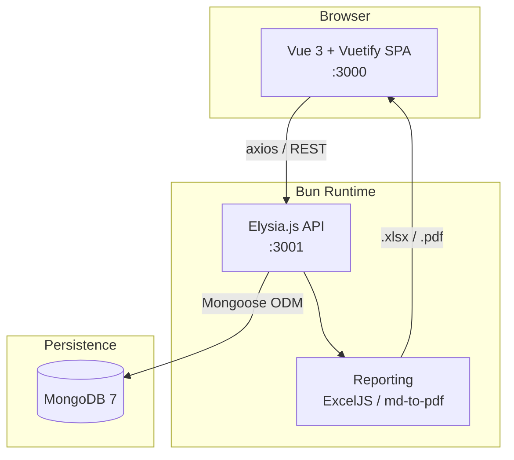
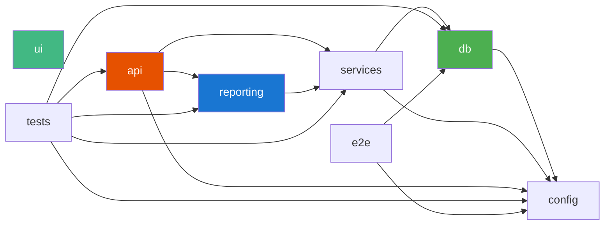
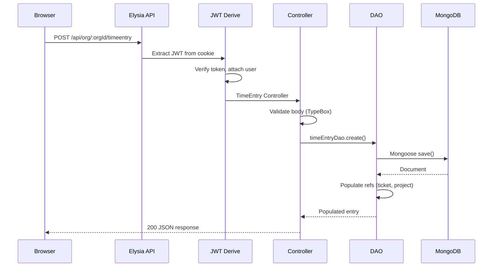
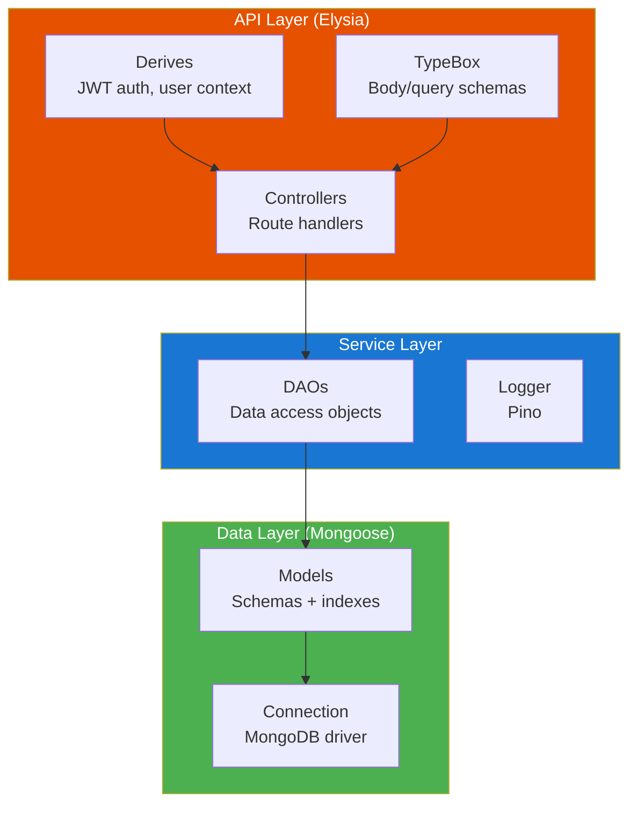
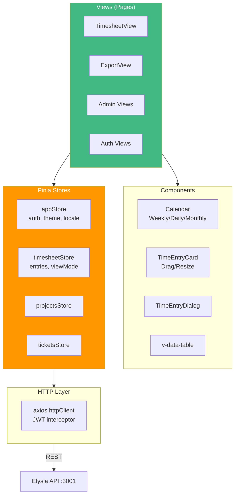

# Architecture

## System Overview

## Monorepo Package Graph

The project is organized as a Bun workspace monorepo with 8 packages. Arrows indicate dependency direction.

### Package Responsibilities

| Package | Purpose | Key Dependencies |
|---------|---------|-----------------|
| **config** | Environment variable loader | — |
| **db** | Mongoose models, connection | config |
| **services** | DAOs, Pino logger | db, config |
| **api** | Elysia.js REST server, JWT auth, CORS | services, reporting, config |
| **reporting** | Excel (ExcelJS) and PDF (md-to-pdf) generators | services |
| **ui** | Vue 3 + Vuetify SPA, Pinia stores, Vue Router | axios (runtime) |
| **tests** | Integration tests, seed script | api, services, db, config, reporting |
| **e2e** | Playwright browser tests | config, db |

## Request Flow

A typical authenticated API request flows through these layers:

## Backend Layers

## Frontend Layers

