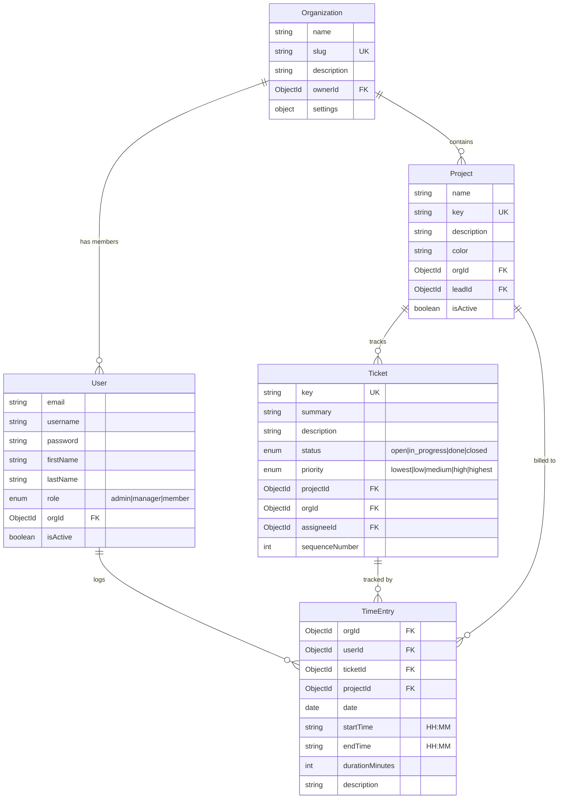

# Data Model

## Entity Relationship Diagram

## Entity Details

### Organization

Multi-tenant root entity. All data is scoped to an organization.

| Field | Type | Constraints | Description |
|-------|------|------------|-------------|
| `name` | String | required | Display name |
| `slug` | String | unique, lowercase | URL-safe identifier for login |
| `description` | String | optional | Organization description |
| `ownerId` | ObjectId → User | required | Admin who created the org |
| `settings.weekStartsOn` | Number | default: 1 | Day of week (1=Monday) |
| `settings.workingHoursPerDay` | Number | default: 8 | Expected daily hours |
| `createdAt` | Date | auto | Timestamp |
| `updatedAt` | Date | auto | Timestamp |

**Indexes:** `slug` (unique)

### User

Organization member with role-based access.

| Field | Type | Constraints | Description |
|-------|------|------------|-------------|
| `email` | String | required | User email |
| `username` | String | required | Login username |
| `password` | String | required, hashed | bcrypt-hashed password |
| `firstName` | String | required | First name |
| `lastName` | String | required | Last name |
| `role` | Enum | `admin` \| `manager` \| `member` | Access level |
| `orgId` | ObjectId → Organization | required | Owning org |
| `isActive` | Boolean | default: true | Account status |

**Indexes:** `(email, orgId)` unique, `(username, orgId)` unique

### Project

Groups tickets and provides color-coding for time entries.

| Field | Type | Constraints | Description |
|-------|------|------------|-------------|
| `name` | String | required | Project name |
| `key` | String | required, uppercase | Short key (e.g., `PCLASS`) |
| `description` | String | optional | Project description |
| `color` | String | default: `#1976D2` | Hex color for UI |
| `orgId` | ObjectId → Organization | required | Owning org |
| `leadId` | ObjectId → User | optional | Project lead |
| `isActive` | Boolean | default: true | Active status |

**Indexes:** `(key, orgId)` unique

### Ticket

Work item linked to a project. Keys are auto-generated (e.g., `PCLASS-101`).

| Field | Type | Constraints | Description |
|-------|------|------------|-------------|
| `key` | String | required | Auto-generated `{projectKey}-{seq}` |
| `summary` | String | required | Short description |
| `description` | String | optional | Full description |
| `status` | Enum | `open` \| `in_progress` \| `done` \| `closed` | Workflow state |
| `priority` | Enum | `lowest` \| `low` \| `medium` \| `high` \| `highest` | Priority level |
| `projectId` | ObjectId → Project | required | Parent project |
| `orgId` | ObjectId → Organization | required | Owning org |
| `assigneeId` | ObjectId → User | optional | Assigned user |
| `reporterId` | ObjectId → User | optional | Reporter |
| `estimatedHours` | Number | optional | Estimated effort |
| `sequenceNumber` | Number | auto-increment | Per-project counter |

**Indexes:** `(key, orgId)` unique, `(projectId, orgId)`

### TimeEntry

A single time tracking record linking a user, ticket, and time range.

| Field | Type | Constraints | Description |
|-------|------|------------|-------------|
| `orgId` | ObjectId → Organization | required | Owning org |
| `userId` | ObjectId → User | required | Who logged it |
| `ticketId` | ObjectId → Ticket | required | Against which ticket |
| `projectId` | ObjectId → Project | required | Derived from ticket |
| `date` | Date | required | Calendar date |
| `startTime` | String | required | `HH:MM` format |
| `endTime` | String | required | `HH:MM` format |
| `durationMinutes` | Number | auto-calculated | `(endH*60+endM) - (startH*60+startM)` |
| `description` | String | optional | Work description |

**Indexes:** `(orgId, userId, date)`, `(orgId, projectId, date)`

## Population Strategy

DAOs use Mongoose `.populate()` to resolve references:

| Query | Populates |
|-------|----------|
| `findByUserAndDateRange` | `ticketId` (key, summary), `projectId` (name, key, color) |
| `findByOrgAndDateRange` | `userId` (firstName, lastName), `ticketId`, `projectId` |
| `findByOrgId` (projects) | `leadId` (firstName, lastName) |
| `findByOrgId` (tickets) | `assigneeId`, `reporterId`, `projectId` |
