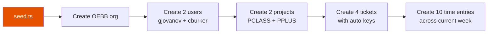

# Deployment

## Docker

```bash
# Start everything (MongoDB + app)
docker compose up --build

# Start only MongoDB
docker compose up -d mongo
```

The app runs on port 3001 in production mode, serving both the API and the built Vue SPA.

### Docker Compose Services

| Service | Image | Port | Description |
|---------|-------|------|-------------|
| `mongo` | mongo:7 | 27017 | MongoDB database |
| `app` | Dockerfile | 3001 | API + static UI |

## Environment Variables

| Variable | Default | Description |
|----------|---------|-------------|
| `MONGODB_URI` | `mongodb://localhost:27017/tickytack` | MongoDB connection string |
| `JWT_SECRET` | `default_secret_change_me` | JWT signing secret |
| `HOST` | `localhost` | API server hostname |
| `PORT` | `3001` | API server port |

### Environment Files

| File | Purpose |
|------|---------|
| `.env` | Development defaults |
| `.env.test` | Test overrides (separate DB, etc.) |

## Seed Data

The seed script populates the database with sample data for development:

```bash
bun run packages/tests/seed/seed.ts
```

### Seeded Entities

| Entity | Data |
|--------|------|
| **Organization** | OEBB (slug: `oebb`, 8h workday, week starts Monday) |
| **Users** | `gjovanov` (admin, password: `admin123`), `cburker` (member, password: `member123`) |
| **Projects** | PCON Classic (`PCLASS`, blue `#1976D2`), PCON Plus (`PPLUS`, orange `#E65100`) |
| **Tickets** | `PCLASS-101` (high, in_progress), `PCLASS-102` (medium, open), `PPLUS-100` (high, done), `PPLUS-101` (highest, in_progress) |
| **Time Entries** | 10 entries across current week, mixed between both users and projects |

### Seed Data Flow



## Internationalization (i18n)

### Supported Locales

| Locale | Language | Status |
|--------|----------|--------|
| `en` | English | Complete |
| `de` | German | Complete |

### Translation Files

Located in `packages/ui/src/locales/{en,de}/`:

| Module | Keys | Description |
|--------|------|-------------|
| `auth.ts` | login, register, fields | Authentication forms |
| `nav.ts` | menu items | Navigation labels |
| `common.ts` | actions, labels | Shared UI text |
| `timesheet.ts` | calendar, entries | Timesheet interface |
| `admin.ts` | CRUD labels | Admin panel |
| `export.ts` | preview, table headers | Export page + preview |
| `validation.ts` | field rules | Form validation messages |
| `errors.ts` | error messages | API error display |
| `messages.ts` | notifications | Success/info messages |

### Adding a New Locale

1. Create a new directory under `packages/ui/src/locales/` (e.g., `fr/`)
2. Copy the module structure from `en/` and translate all strings
3. Add the locale to `SUPPORTED_LOCALES` in `packages/ui/src/locales/index.ts`
4. Add column header translations to `packages/reporting/excel/timesheet.excel.ts` and `packages/reporting/pdf/timesheet.pdf.ts`

### Export Localization

Excel and PDF generators have their own locale maps for column headers:

```typescript
// packages/reporting/excel/timesheet.excel.ts
const columnHeaders = {
  en: { date: 'Date', start: 'Start', end: 'End', hours: 'Hours', ... },
  de: { date: 'Datum', start: 'Beginn', end: 'Ende', hours: 'Stunden', ... },
}
```

## Production Build

```bash
# Build the Vue SPA
bun run --filter '@ttt/ui' build

# Start the API (serves built UI from dist/)
bun run packages/api/src/index.ts
```

The Elysia server uses `@elysiajs/static` to serve the built Vue SPA alongside the API on port 3001.
