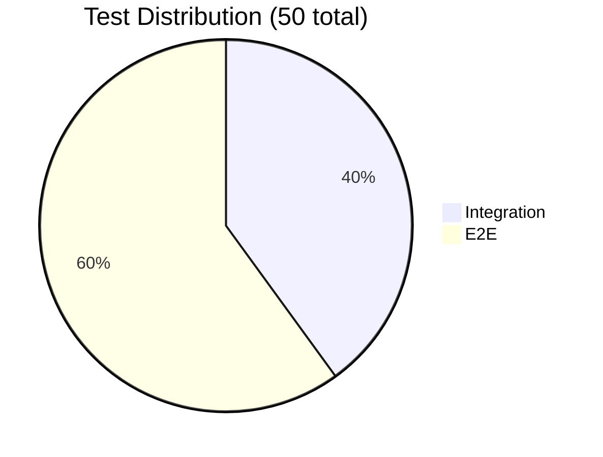
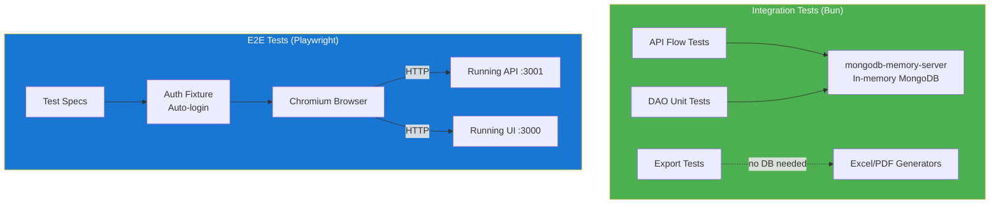

# Testing

## Test Distribution



## Integration Tests (20 tests)

Located in `packages/tests/`. Uses Bun test runner with mongodb-memory-server for isolated database testing.

```bash
# Run all integration tests
bun test packages/tests

# Run with coverage
cd packages/tests && bun test --coverage
```

### Test Suites

| File | Tests | Description |
|------|-------|-------------|
| `integration/flow.test.ts` | 6 | Full API flow: register, login, project/ticket/timeentry CRUD |
| `unit/dao.test.ts` | 5 | DAO layer: user, org, project, ticket, timeentry queries |
| `integration/export.test.ts` | 9 | Excel generation, formulas, column order, overrides, locales |

### Export Tests Detail

| Test | Verifies |
|------|----------|
| Generate valid XLSX buffer | Buffer starts with PK (ZIP header) |
| Empty entries returns undefined | No file generated for empty data |
| German locale | Headers use German translations |
| String dates | Handles ISO string dates |
| Missing optional fields | Graceful handling of sparse entries |
| **Formulas for Hours and Total** | `D{n}` contains `(C{n}-B{n})*24`, total contains `SUM(D{first}:D{last})` |
| **Description overrides** | Overridden entries use custom text, others keep original |
| **Time-formatted values** | Start/End stored as fractions with `HH:mm` numFmt |
| **Column order** | Date, Start, End, Hours, Project, Ticket, Summary, Description |

## E2E Tests (30 tests)

Located in `packages/e2e/`. Uses Playwright 1.52 with Chromium.

```bash
# Install browsers (first time)
cd packages/e2e && bunx playwright install chromium

# Compile TypeScript to JS
bun build tests/*.spec.ts --no-bundle --target=node --outdir=tests

# Run all E2E tests
SKIP_SEED=1 ~/node/bin/node node_modules/.bin/playwright test --config playwright.config.js

# Run with visual UI mode
bun run test:e2e:ui
```

### Test Suites

| File | Tests | Description |
|------|-------|-------------|
| `tests/auth.spec.ts` | 4 | Login, register, validation, redirect |
| `tests/timesheet.spec.ts` | 8 | Calendar views, CRUD, resize, drag-drop positioning, dialog guards |
| `tests/projects.spec.ts` | 4 | Project CRUD, color picker, data table |
| `tests/tickets.spec.ts` | 4 | Ticket CRUD, project filter, search |
| `tests/users.spec.ts` | 4 | User CRUD, role management, active toggle |
| `tests/export.spec.ts` | 4 | Excel/PDF POST download, preview table, description override |
| `tests/i18n.spec.ts` | 2 | Language toggle, locale persistence |

### Timesheet Tests Detail

| Test | Verifies |
|------|----------|
| Calendar renders current week | Weekly view controls and date range visible |
| Create time entry via dialog | Slot click opens dialog with ticket field |
| Edit time entry opens pre-filled dialog | Card click opens dialog with existing values |
| View mode switching | Daily/Weekly/Monthly toggle works |
| Ticket dropdown pre-populated | Autocomplete shows options without typing |
| **Resize changes duration, no dialog** | Resize handle works, card grows, edit dialog does NOT open |
| **Drag-drop positions by card top** | Entry positions by card top edge (not mouse pointer), dialog does NOT open |
| Delete time entry removes card | Delete button in dialog removes entry |

### Export Tests Detail

| Test | Verifies |
|------|----------|
| **Excel downloads via POST** | Intercepts request, verifies `method === 'POST'`, checks body has `descriptionOverrides` |
| **PDF downloads via POST** | Same POST verification for PDF endpoint |
| **Preview table appears** | Data table visible with correct column order (8 columns) and data rows |
| **Description override** | Input field in preview row accepts and persists custom text |

## Test Architecture



### E2E Test Infrastructure

- **Auth fixture** (`fixtures/auth.fixture.ts`): Provides `authenticatedPage` that auto-logs in before each test
- **Helpers** (`helpers/selectors.ts`): Vuetify-aware utilities (`navigateViaNav`, `waitForLoad`, `waitForDialog`)
- **Global setup** (`global-setup.ts`): Seeds database before test run
- **Playwright config**: Chromium-only, runs against live API + UI servers
- **Compilation**: TypeScript specs are pre-compiled to JS via `bun build --no-bundle --target=node` (Bun's node shim breaks Playwright)
