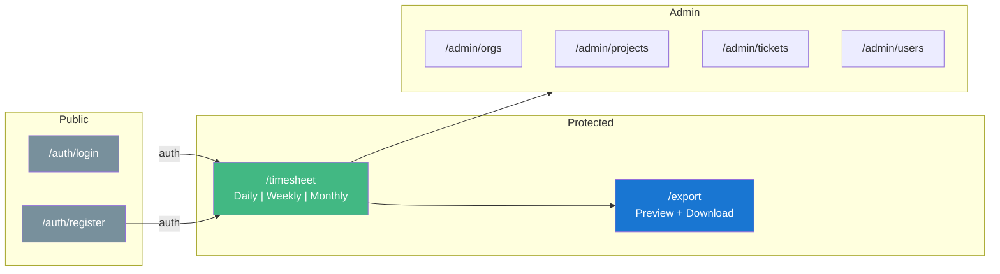
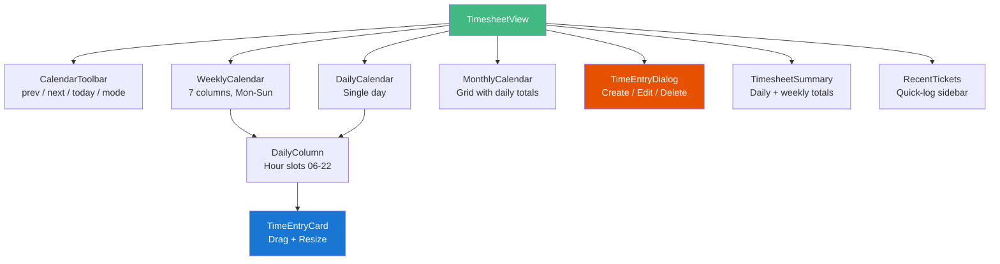
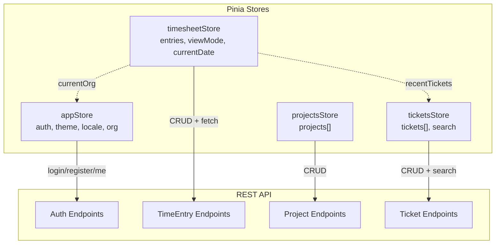

# UI & Components

## Page Map

## Routes

| Path | View | Auth | Description |
|------|------|------|-------------|
| `/auth/login` | LoginView | public | Org slug + username + password login |
| `/auth/register` | RegisterView | public | New user + organization registration |
| `/` | — | redirect | Redirects to `/timesheet` |
| `/timesheet` | TimesheetView | protected | Main time tracking calendar |
| `/export` | ExportView | protected | Export with preview table |
| `/admin/orgs` | OrgView | protected | Organization management |
| `/admin/projects` | ProjectsView | protected | Project CRUD |
| `/admin/tickets` | TicketsView | protected | Ticket CRUD with project filter |
| `/admin/users` | UsersView | protected | User management with roles |

Navigation guard redirects unauthenticated users to `/auth/login`.

## Views & Components

### TimesheetView

The main time tracking interface with three calendar view modes.

| Component | File | Purpose |
|-----------|------|---------|
| **CalendarToolbar** | `CalendarToolbar.vue` | Navigation (prev/next/today) and view mode toggle (daily/weekly/monthly) |
| **WeeklyCalendar** | `WeeklyCalendar.vue` | 7-day view with DailyColumn per day, 06:00-22:00 slots, auto-scroll to 08:00 |
| **DailyCalendar** | `DailyCalendar.vue` | Single-day view with one DailyColumn |
| **MonthlyCalendar** | `MonthlyCalendar.vue` | Month grid showing total hours per day, colored dots per project |
| **DailyColumn** | `DailyColumn.vue` | Hour slots, drag-drop target, click-to-create, 15-min snap grid |
| **TimeEntryCard** | `TimeEntryCard.vue` | Draggable card with resize handle, project color, ticket info |
| **TimeEntryDialog** | `TimeEntryDialog.vue` | Modal for create/edit with autocomplete ticket search, time pickers |
| **TimesheetSummary** | `TimesheetSummary.vue` | Weekly bar: daily totals (green >= 8h) and weekly total (green >= 40h) |
| **RecentTickets** | `RecentTickets.vue` | Sidebar widget for quick time entry creation from recent tickets |

### ExportView

Export with live preview and editable descriptions.

| Section | Description |
|---------|-------------|
| Format selector | Excel (.xlsx) or PDF |
| Date range | Start/end date pickers |
| Preview table | `v-data-table` with columns: Date, Start, End, Hours, Project, Ticket, Summary, Description |
| Description override | Inline `v-text-field` per row to customize description before export |
| Download button | POST to `/export/{format}` with overrides |

### Admin Views

| View | Key Features |
|------|-------------|
| **ProjectsView** | Data table, color picker, key/name/lead columns, active toggle |
| **TicketsView** | Data table, multi-project filter dropdown, status/priority chips |
| **UsersView** | Data table, role selection, active/inactive toggle, password change |
| **OrgView** | Data table, settings (working hours, week start) |

## State Management

### appStore

| State | Type | Description |
|-------|------|-------------|
| `auth.user` | Object | Current user (null if logged out) |
| `auth.token` | String | JWT token |
| `currentOrg` | Object | Active organization |
| `orgs` | Array | User's organizations |
| `theme` | `'light'` \| `'dark'` | Active theme |
| `locale` | `'en'` \| `'de'` | Active locale |
| `leftDrawer` | Boolean | Navigation drawer state |

**Actions:** `login`, `register`, `logout`, `fetchMe`, `toggleTheme`, `setLocale`, `toggleLocale`

### timesheetStore

| State | Type | Description |
|-------|------|-------------|
| `currentDate` | Date | Selected date |
| `viewMode` | `'daily'` \| `'weekly'` \| `'monthly'` | Calendar view |
| `entries` | Array | Time entries for current range |
| `recentTickets` | Array | Last 10 unique tickets from entries |
| `loading` | Boolean | Fetch in progress |

**Actions:** `fetchEntries`, `createEntry`, `updateEntry`, `deleteEntry`, `goToNext`, `goToPrevious`, `goToToday`, `setViewMode`

### projectsStore

| State | Type | Description |
|-------|------|-------------|
| `projects` | Array | All projects in org |
| `loading` | Boolean | Fetch in progress |

**Actions:** `fetchProjects`, `createProject`, `updateProject`, `deleteProject`

### ticketsStore

| State | Type | Description |
|-------|------|-------------|
| `tickets` | Array | Tickets (filtered by project) |
| `searchResults` | Array | Ticket search results |
| `selectedProjectIds` | Array | Active project filters |
| `loading` | Boolean | Fetch in progress |

**Actions:** `fetchTickets`, `fetchTicketsForProjects`, `searchTickets`, `createTicket`, `updateTicket`, `deleteTicket`
