# Use Cases

## User Roles & Permissions

### Permission Matrix

| Resource | Admin | Manager | Member |
|----------|-------|---------|--------|
| Organizations | CRUD | Read | Read |
| Users | CRUD | Create/Edit | Read (self) |
| Projects | CRUD | Create/Edit | Read |
| Tickets | CRUD | CRUD | Read/Create |
| Time Entries | CRUD | CRUD | CRUD (own) |
| Export | Download | Download | Download |

## Authentication Flow

## Time Entry Lifecycle

```mermaid
stateDiagram-v2
    [*] --> Created: Click slot / Quick-log
    Created --> Resized: Drag resize handle
    Created --> Moved: Drag to new slot/day
    Created --> Edited: Click card → dialog
    Resized --> Edited
    Moved --> Edited
    Edited --> Exported: Export page
    Edited --> Deleted: Delete button
    Exported --> [*]: .xlsx / .pdf download
    Deleted --> [*]
```

### Creating a Time Entry

Three methods to create a time entry:

### Drag & Drop

When dragging a time entry to a new slot:

1. `dragstart` stores entry data + **grab offset** (mouse position relative to card top)
2. `dragover` on target column highlights drop zone
3. `drop` calculates new start time using **card top position** (mouse Y minus grab offset), snapped to 15-minute grid
4. New end time preserves original duration
5. API `PUT` updates the entry

### Resize

When resizing a time entry via the bottom handle:

1. `mousedown` on resize handle starts tracking
2. `mousemove` updates card height in real-time (snapped to 15 minutes)
3. `mouseup` emits new end time and duration
4. API `PUT` sends both `startTime` + `endTime` so backend recalculates duration
5. Click guard (`recentlyResized` flag, 300ms timeout) prevents the edit dialog from opening

## Export Workflow

### Description Overrides

Users can customize time entry descriptions in the export preview without modifying the original data:

1. Preview table loads entries for the selected date range
2. Each row has an editable description field
3. Modified descriptions are stored in a `descriptionOverrides` map (`{ entryId: text }`)
4. On download, overrides are sent to the API and applied during file generation
5. Original time entry descriptions remain unchanged in the database

## Multi-Tenant Data Flow

All API endpoints under `/org/:orgId/...` ensure data isolation between organizations. Users can only access data within their own organization.
